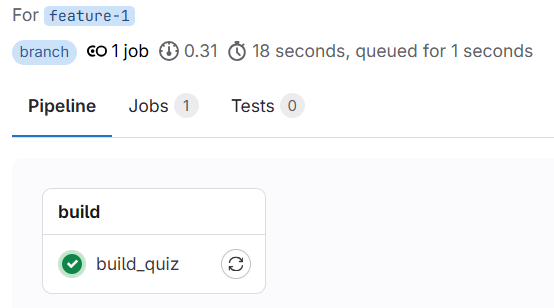
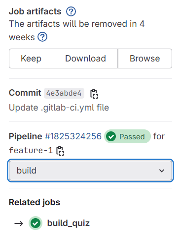
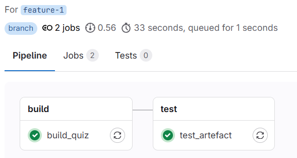
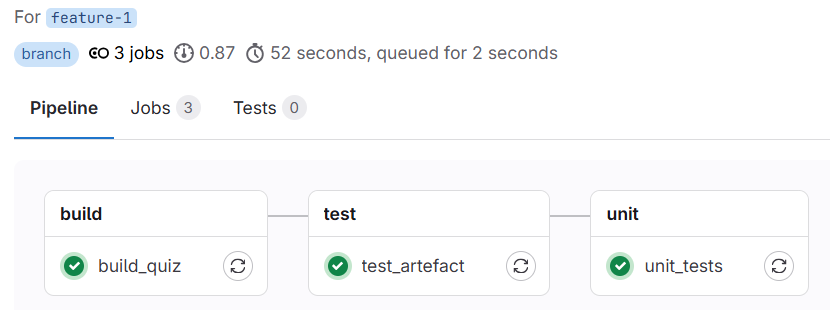
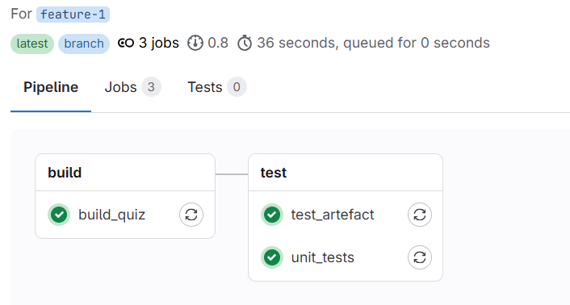

## Atelier 2 : CI/CD avec GitLab 

## 🎯 Objectifs
Mettre en place un pipeline d'intégration continu / de livraison et déploiement continu d’un projet Node.js.

---

## PARTIE 1 – Integration continu (CI) avec GitLab

### 1 Forke le projet quiz-app :

**[https://gitlab.com/ftutorials-projets/quiz-app](https://gitlab.com/ftutorials-projets/quiz-app)**

### 2 Crée un pipeline CI avec un stage `build` qui s’exécute uniquement sur une branche feature.

Resultat attendu : 

### 3 Modifie `.gitlab-ci.yml` pour générer un artefact. 

Resultat attendu : 

### 4 Ajoute un job pour tester l’artefact (vérifier la présence de `index.html`).

Resultat attendu : 

### 5 Ajoute un job des tests unitaires.

Resultat attendu : 

### 6 Exécute les jobs de test en parallèle.

Resultat attendu : 

---

## PARTIE 2 – Livraison et déploiement continu (CD) avec GitLab

### 7 Ajoute une étape de build et de push de l’image Docker vers le GitLab Container Registry.

### 8 Déploie cluster kubernetes k3s :

**[https://github.com/franklin-tutorials/devops/blob/main/k3s/README.md](https://github.com/franklin-tutorials/devops/blob/main/k3s/README.md)**

### 9 Integre cluster kubernetes avec [GitLab](https://docs.gitlab.com/user/clusters/agent/)

### 10 Ajoute un job de déploiement dans `.gitlab-ci.yml`.

### 11 Assure toi que le CI/CD de l'application quiz-app fonctionne correctement.

---

**Atelier terminé ! Félicitations pour ton travail !**

Retour à la page [Débuter avec GitLab](README.md).